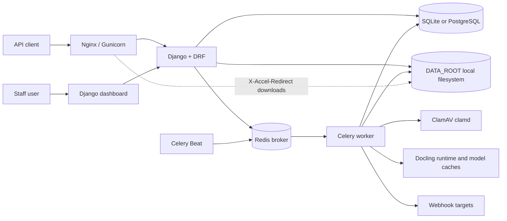

# DocumentRefinery

Status: Beta. Current release: `v0.1.0`.

DocumentRefinery is a tenant-aware document extraction service built with Django,
Django REST Framework, Celery, Docling, ClamAV, and local filesystem storage. It
accepts document uploads, scans them before processing, runs Docling conversion in
background workers, stores derived artifacts, and exposes operator-facing dashboard
views plus API-first integration endpoints.

The project is usable for local and single-host deployments, but it is still
pre-1.0. See [Known Limitations](#known-limitations) before treating it as a
security-sensitive production service.

## Implemented Features

- Tenant-scoped API keys with hashed key storage, scopes, last-used tracking,
  rotation/deactivation in Django Admin, and per-key upload MIME allowlists.
- Upload API for PDF, DOCX, PPTX, and XLSX inputs with signature checks, size
  limits, quarantine storage, SHA-256 dedupe per tenant, and optional immediate
  ingestion.
- Celery ingestion pipeline: virus scan with ClamAV, Docling conversion, artifact
  export, optional chunk generation, final status updates, and job webhooks.
- Docling option handling with tenant/key defaults, request overrides, profile
  presets, option resolution endpoints, and deployment-level OCR/tokenizer
  allowlists.
- Artifacts stored under `DATA_ROOT`, with checksums, sizes, retention timestamps,
  preview endpoints, direct streaming, and optional Nginx `X-Accel-Redirect`
  downloads.
- Job lifecycle APIs for listing, filtering, canceling, retrying failed work, and
  inspecting timing/runtime/result metrics.
- PDF profile comparison jobs that run multiple Docling profiles against the same
  document and group jobs by `comparison_id`.
- Webhook endpoint CRUD and `job.updated` deliveries with retry/backoff, HMAC
  signatures, delivery history, URL validation, and private-address protection.
- Staff dashboard pages for operations, uploads, jobs, profile comparison,
  Docling profiles, API keys, webhooks, webhook deliveries, system status, and
  runtime diagnostics.
- Dashboard API for summary metrics, Celery worker inspection, usage reporting,
  and runtime diagnostics.
- Internal `healthz`, `readyz`, and Prometheus-style `metrics` endpoints guarded
  by `INTERNAL_ENDPOINTS_TOKEN`.
- Retention cleanup tasks for expired artifacts, expired documents, and infected
  quarantine files, scheduled hourly through Celery Beat.
- Ubuntu-oriented install/update scripts for a single-host Gunicorn, Celery,
  Redis, ClamAV, Nginx, and optional PostgreSQL deployment.

Not implemented yet: object storage, multi-region deployment, billing, per-tenant
quota enforcement, HTML/image/audio inputs, and real end-to-end CI against live
external services.

## Architecture



Storage is local-first. The application stores quarantine files, clean source
files, and artifacts below `DATA_ROOT`; Nginx can serve artifact files through an
internal protected location when `X_ACCEL_REDIRECT_ENABLED=true`.

## API Surface

All `/v1/` API endpoints require `Authorization: Api-Key <token>` unless noted.

| Area | Endpoints |
| --- | --- |
| Schema | `GET /v1/schema/` |
| Documents | `POST /v1/documents/`, `GET /v1/documents/`, `GET /v1/documents/{id}/`, `POST /v1/documents/{id}/compare/`, `POST /v1/documents/{uuid}/ingest/` |
| Jobs | `GET /v1/jobs/`, `GET /v1/jobs/{id}/`, `POST /v1/jobs/{id}/cancel/`, `POST /v1/jobs/{id}/retry/` |
| Artifacts | `GET /v1/artifacts/`, `GET /v1/artifacts/?job_id=...`, `GET /v1/artifacts/{id}/`, `GET /v1/artifacts/{id}/preview/` |
| Docling metadata | `GET /v1/docling/profiles/`, `GET /v1/docling/capabilities/`, `POST /v1/docling/options/resolve/` |
| Webhooks | `GET/POST /v1/webhooks/`, `GET/PATCH/PUT/DELETE /v1/webhooks/{id}/` |
| Dashboard API | `GET /v1/dashboard/summary`, `GET /v1/dashboard/workers`, `GET /v1/dashboard/reports/usage`, `GET /v1/dashboard/runtime` |
| Internal ops | `GET /healthz`, `GET /readyz`, `GET /metrics` with `X-Internal-Token` |

Important scopes:

- `documents:read`, `documents:write`
- `jobs:read`, `jobs:write`
- `artifacts:read`
- `dashboard:read`
- `webhooks:read`, `webhooks:write`

## Quickstart

```bash
python3 -m venv venv
./venv/bin/pip install -r requirements.txt
cp .env.example .env
./venv/bin/python document_refinery/manage.py migrate
./venv/bin/python document_refinery/manage.py createsuperuser
./venv/bin/python document_refinery/manage.py runserver
```

Start a Celery worker from a second terminal:

```bash
cd document_refinery
../venv/bin/celery -A config worker --loglevel=INFO
```

Start Celery Beat as well when retention cleanup should run automatically:

```bash
cd document_refinery
../venv/bin/celery -A config beat --loglevel=INFO
```

Create a tenant and API key in Django Admin, then upload a document:

```bash
curl -X POST http://localhost:8000/v1/documents/ \
  -H "Authorization: Api-Key <your-key>" \
  -F "file=@sample.pdf" \
  -F "ingest=true"
```

Upload options are JSON-compatible. Example with explicit exports:

```bash
curl -X POST http://localhost:8000/v1/documents/ \
  -H "Authorization: Api-Key <your-key>" \
  -F "file=@sample.pdf" \
  -F "ingest=true" \
  -F 'options_json={"exports":["markdown","text","doctags","chunks_json"]}'
```

## Configuration

See `.env.example` for the complete list. The most important values are:

- `SECRET_KEY`
- `DATA_ROOT`, `HF_HOME`, `DOCLING_CACHE_DIR`, `DOCLING_ARTIFACTS_PATH`
- `DOCLING_DEVICE`, `DOCLING_NUM_THREADS`, `DOCLING_ALLOWED_OCR_ENGINES`
- `UPLOAD_MAX_SIZE_MB`, `MAX_PAGES`
- `DOCUMENT_RETENTION_DAYS`, `ARTIFACT_RETENTION_DAYS`,
  `INFECTED_QUARANTINE_RETENTION_DAYS`
- `CELERY_BROKER_URL`, `CELERY_RESULT_BACKEND`, `CELERY_WORKER_CONCURRENCY`
- `CLAMAV_HOST`, `CLAMAV_PORT`, or `CLAMAV_SOCKET`
- `X_ACCEL_REDIRECT_ENABLED`, `X_ACCEL_REDIRECT_LOCATION`
- `INTERNAL_ENDPOINTS_TOKEN`
- `WEBHOOK_ALLOWED_HOSTS`, `WEBHOOK_INCLUDE_ERROR_DETAILS`,
  `API_INCLUDE_ERROR_DETAILS`
- `DATABASE_URL` for PostgreSQL; SQLite is the default if unset

## Local Tests

```bash
venv/bin/python document_refinery/manage.py test
venv/bin/python -m coverage run document_refinery/manage.py test
venv/bin/python -m coverage report -m
```

The current local coverage run is documented in `AGENTS.md`. CI is configured as
a manual GitHub Actions workflow (`workflow_dispatch`) with Django tests, Ruff,
and coverage `--fail-under=90`.

## Deployment

For a single Ubuntu host, use:

```bash
sudo python3 deploy/install_document_refinery.py
```

The installer can create `.env`, install system dependencies, configure systemd
units, configure Nginx, run migrations, collect static files, enable ClamAV
signature updates, warm Docling models, and optionally request TLS with Certbot.

Useful follow-up commands:

```bash
sudo python3 deploy/install_document_refinery.py --resume
sudo python3 deploy/install_document_refinery.py --only-nginx
sudo python3 deploy/install_document_refinery.py --skip-migrate
./deploy/update_document_refinery.sh
```

See `DEPLOYMENT.md`, `deploy/README.md`, and `EXTERNAL_SERVICES.md` for more
operational detail.

## Known Limitations

- API keys are hashed with HMAC-SHA256 using Django `SECRET_KEY`. Rotating
  `SECRET_KEY` without a migration or key rotation plan makes existing API keys
  impossible to look up.
- Webhook signing secrets are stored in plaintext in the `WebhookEndpoint.secret`
  database field so workers can sign outbound requests. Database access and
  backups must be treated as secret-bearing until encrypted-field or KMS support
  is added.
- Tests mock external services heavily. ClamAV responses, Docling conversion, and
  webhook delivery paths are covered with mocks/fakes; the default test suite
  does not prove real ClamAV, real Docling model execution, or real third-party
  webhook endpoints end to end.
- Runtime diagnostics and Celery worker inspection are best-effort and depend on
  broker availability and worker configuration.
- Artifact storage is local filesystem only. There is no S3/object-storage
  backend or cross-host shared storage abstraction.
- Quotas and disk-pressure controls are not implemented yet; operators must
  monitor `DATA_ROOT` capacity externally.

## Documentation Map

- `API_INTEGRATION.md` - client-facing API integration guide.
- `ENDPOINTS.md` - endpoint notes.
- `DEPLOYMENT.md` and `deploy/README.md` - deployment and operations.
- `EXTERNAL_SERVICES.md` and `EXTERNAL_RELATIONS.md` - external dependencies and
  integration context.
- `DECISIONS.md` - recorded implementation decisions.
- `docs/archive/docling_django_task_list.md` - archived pre-beta planning
  checklist retained for historical context.
